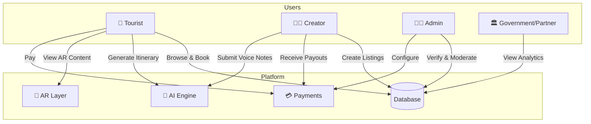
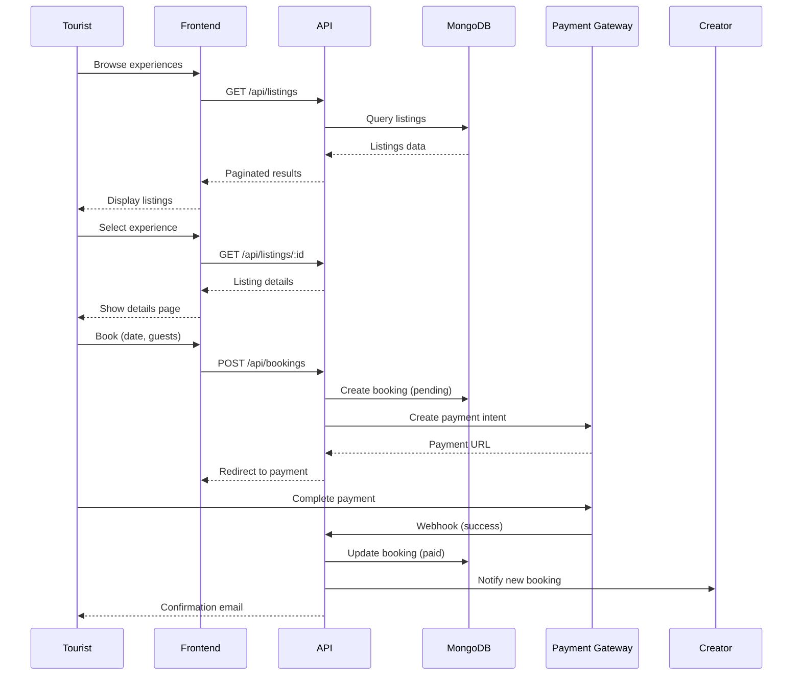
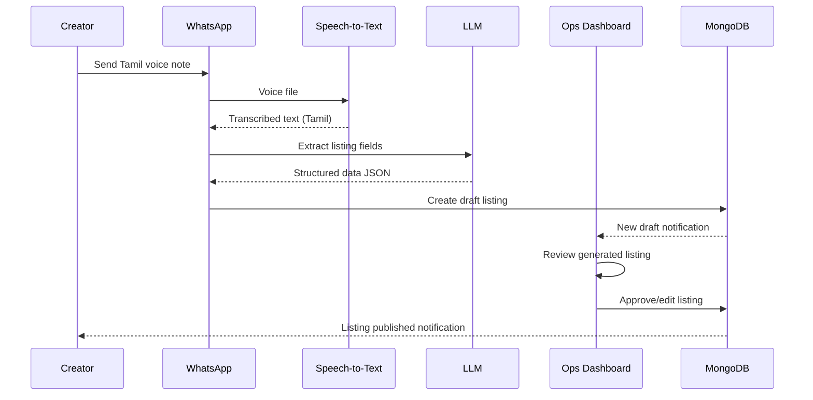
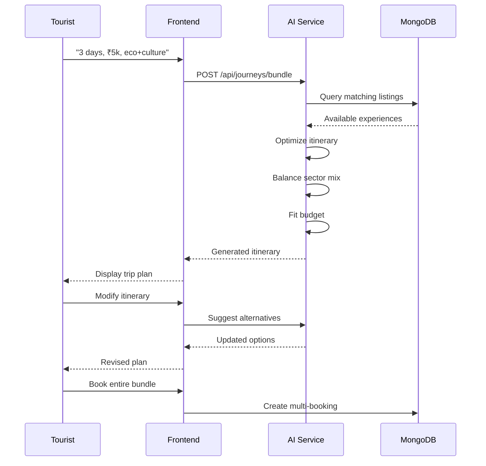
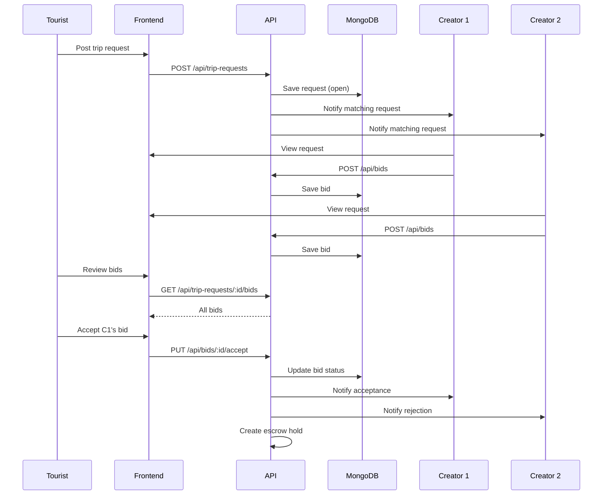
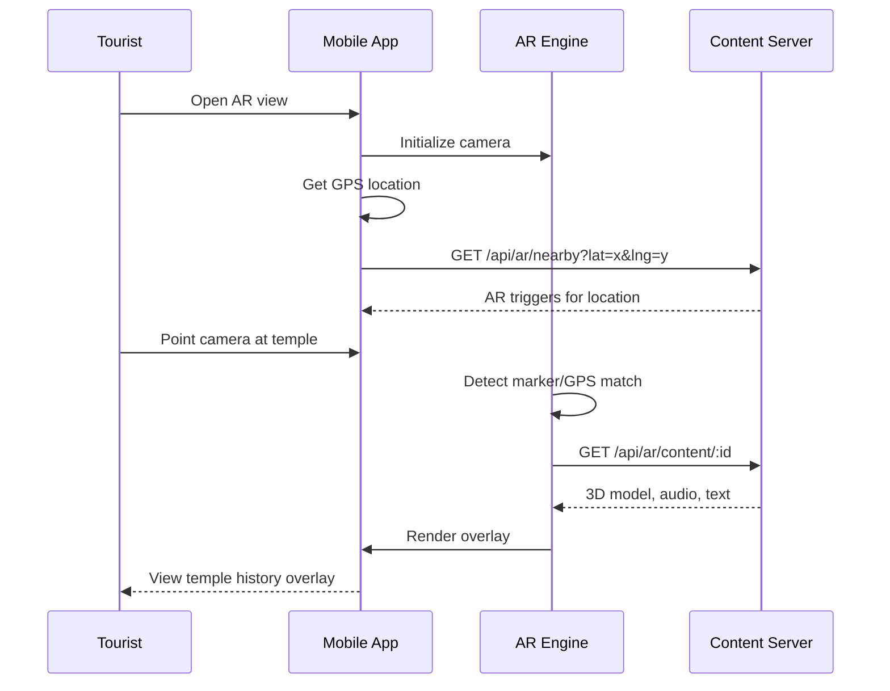

# 🌾 Heritage-Farm Tamil Nadu

> **AI-Powered Unified Tourism Marketplace for Tamil Nadu**  
> Connecting Agri-Rural, Heritage-Culture, and Eco-Adventure experiences through intelligent journey optimization.

<div align="center">


**Production URLs**  
[Frontend (Vercel)](https://heritage-farm-tn.vercel.app/)  
[Backend (Render)](https://heritage-farm-tn.onrender.com)

</div>

---

## 📋 Table of Contents

- [Vision](#-vision)
- [Key Features](#-key-features)
- [User Roles](#-user-roles)
- [Technology Stack](#-technology-stack)
- [Version Roadmap](#-version-roadmap)
- [API Reference](#-api-reference)
- [Data Models](#-data-models)
- [End-to-End Flows](#-end-to-end-flows)
- [Production Scaling](#-production-scaling)
- [Getting Started](#-getting-started)

---

## 🎯 Vision

Heritage-Farm is a **unified AI tourism marketplace** that connects three core sectors of Tamil Nadu tourism:

| Sector | Experiences |
|--------|-------------|
| 🌾 **Agri-Rural** | Farm stays, organic farming tours, rural crafts, pottery workshops |
| 🛕 **Heritage-Culture** | Temple tours, traditional arts, cultural performances, historical sites |
| 🏔️ **Eco-Adventure** | Trekking, wildlife safaris, bird watching, nature trails |

The platform enables **cross-sector bundling**, **AI-powered trip planning**, **AR-enhanced storytelling**, and **transparent revenue sharing** with local creators.

---

## ✨ Key Features

### 🎒 For Tourists

| Feature | Description |
|---------|-------------|
| **Smart Onboarding** | Personalized profile with interests, budget, dates, group size |
| **AI Trip Builder** | Natural language input → Auto-generated multi-sector itinerary |
| **Curated Journey Arcs** | Pre-built multi-day experiences (e.g., "4-Day Heritage Farmer's Discovery") |
| **Unified Cart & Checkout** | Book multiple creators (farm + temple + trek) in single transaction |
| **AR Experiences** | Immersive overlays at temples, farms, and trails |
| **In-Journey UX** | Live itinerary timeline, maps, navigation, creator contacts |
| **Reviews & Media** | Rating system with photo/video uploads |
| **Multi-Language** | Full Tamil and English support via i18n |

### 🧑‍🌾 For Creators (Farmers, Artisans, Guides)

| Feature | Description |
|---------|-------------|
| **Simple Onboarding** | Form-based or Voice-based (Tamil) listing creation |
| **KYC Integration** | Aadhaar/GST verification, bank/UPI payout setup |
| **Experience Management** | Create/edit tours, homestays, workshops with capacity & pricing |
| **Booking Dashboard** | View, confirm/decline, mark no-shows |
| **Earnings Analytics** | Daily/weekly revenue, withdrawal history, payout tracking |
| **Messaging** | Direct chat with tourists and platform support |
| **Reverse Auction Bidding** | Respond to tourist trip requests with competitive proposals |

### 👨‍💼 For Admins

| Feature | Description |
|---------|-------------|
| **Creator Verification** | Approve/reject new creator applications |
| **Listing Moderation** | Quality control and content approval |
| **Commission Management** | Configurable platform fee (20-25%) |
| **Analytics Dashboard** | Bookings, revenue, sector trends, seasonality |
| **Conservation Fund** | Monitor fund accrual and utilization |
| **Campaign Management** | Sector-specific promotions and discounts |

### 🏛️ For Government/Partners (Future)

| Feature | Description |
|---------|-------------|
| **Read-Only Dashboards** | Economic impact metrics |
| **Conservation Reports** | Fund utilization transparency |
| **Tourism Analytics** | Regional trends and patterns |

---

## 👥 User Roles



---

## 🛠️ Technology Stack

### Current Stack (MERN + Bun)

| Layer | Technology |
|-------|------------|
| **Frontend** | React 19 + Vite 7 + TypeScript |
| **Backend** | Bun + Express.js + TypeScript |
| **Database** | MongoDB with Mongoose ODM |
| **Search** | Elasticsearch / Meilisearch |
| **Cache** | Redis |
| **File Storage** | AWS S3 / Cloudinary |
| **Payments** | Razorpay (UPI/Cards) + Stripe |
| **AI/ML** | OpenAI API / Custom Models |
| **AR** | AR.js + A-Frame (WebAR) |
| **i18n** | react-i18next |
| **Auth** | JWT + OAuth 2.0 |

### Recommended Production Stack

```
┌─────────────────────────────────────────────────────────────────┐
│                        CDN (CloudFront/Cloudflare)               │
├─────────────────────────────────────────────────────────────────┤
│                     Load Balancer (AWS ALB)                      │
├────────────────────────┬────────────────────────────────────────┤
│   Tourist App (PWA)    │   Creator App (Lite PWA)    │ Admin    │
│   React + Vite         │   React (Optimized)         │ Panel    │
├────────────────────────┴────────────────────────────────────────┤
│                     API Gateway (Kong/AWS API GW)                │
├───────────┬───────────┬───────────┬───────────┬─────────────────┤
│ Auth      │ Listings  │ Bookings  │ AI/ML     │ Payments        │
│ Service   │ Service   │ Service   │ Service   │ Service         │
├───────────┴───────────┴───────────┴───────────┴─────────────────┤
│            Message Queue (RabbitMQ / AWS SQS)                    │
├─────────────────────────────────────────────────────────────────┤
│  MongoDB   │  Redis   │  Elasticsearch  │  S3   │  PostgreSQL   │
└─────────────────────────────────────────────────────────────────┘
```

---

## 📅 Version Roadmap

### Version 0.1.0 - Foundation (Current)
> **Status:** 🔴 Not Started | **Timeline:** Week 1-2

- [ ] Project scaffolding and monorepo setup
- [ ] Backend API boilerplate with Express + TypeScript
- [ ] MongoDB connection and base models
- [ ] Frontend routing and layout components
- [ ] Basic authentication (JWT)
- [ ] Development environment configuration

---

### Version 0.2.0 - Core Authentication & Users
> **Status:** 🔴 Not Started | **Timeline:** Week 3-4

#### Features:
- [ ] **Tourist Registration/Login**
  - Email/phone signup
  - Social login (Google, Facebook)
  - Profile management
  - Language preference (Tamil/English)
  
- [ ] **Creator Registration/Login**
  - Basic KYC form (Aadhaar/GST)
  - Bank/UPI details collection
  - Profile creation
  - Pending approval status
  
- [ ] **Admin Authentication**
  - Secure admin login
  - Role-based access control
  
- [ ] **i18n Integration**
  - Tamil and English translations
  - Language switcher component

---

### Version 0.3.0 - Listings & Discovery MVP
> **Status:** 🔴 Not Started | **Timeline:** Week 5-7

#### Features:
- [ ] **Listing Creation (Creators)**
  - Experience form (title, description, category)
  - Pricing and capacity
  - Schedule and availability
  - Image uploads
  - Location picker (map integration)
  
- [ ] **Listing Discovery (Tourists)**
  - Browse all experiences
  - Category filters (Agri/Heritage/Eco)
  - Location-based search
  - Date filtering
  - Price range filters
  - Difficulty level filters (for treks)
  
- [ ] **Listing Details Page**
  - Full experience information
  - Image gallery
  - Creator profile card
  - Availability calendar

- [ ] **Admin Listing Approval**
  - Pending listings queue
  - Approve/reject workflow
  - Moderation notes

---

### Version 0.4.0 - Booking & Payments MVP
> **Status:** 🔴 Not Started | **Timeline:** Week 8-10

#### Features:
- [ ] **Booking Flow**
  - Date selection
  - Guest count
  - Price calculation
  - Booking request submission
  
- [ ] **Payment Integration**
  - Razorpay integration (UPI, Cards, Wallets)
  - Payment intent creation
  - Success/failure handling
  - Receipt generation
  
- [ ] **Creator Booking Management**
  - Incoming bookings list
  - Confirm/decline actions
  - Booking calendar view
  
- [ ] **Revenue Split Engine**
  - Creator share (70-75%)
  - Platform commission (20-25%)
  - Conservation fund (1-3%)
  - Transparent breakdown

- [ ] **Payout System**
  - Earnings dashboard
  - Withdrawal requests
  - Bank/UPI transfers

---

### Version 0.5.0 - Reviews & Messaging
> **Status:** 🔴 Not Started | **Timeline:** Week 11-12

#### Features:
- [ ] **Review System**
  - Post-booking review prompt
  - 5-star rating
  - Text reviews
  - Photo/video uploads
  - Review display on listings
  
- [ ] **Messaging System**
  - Tourist ↔ Creator chat
  - Real-time messaging (WebSocket)
  - Notification system
  - Chat history

---

### Version 0.6.0 - Curated Journeys & Bundles
> **Status:** 🔴 Not Started | **Timeline:** Week 13-15

#### Features:
- [ ] **Journey Arc Creation (Admin)**
  - Multi-day itinerary builder
  - Cross-sector bundling
  - Bundle pricing
  - Featured journeys
  
- [ ] **Journey Discovery (Tourist)**
  - Browse curated journeys
  - "4-Day Heritage Farmer's Discovery"
  - "Weekend Eco Retreat"
  - Journey detail pages
  
- [ ] **Bundle Booking**
  - Multi-experience cart
  - Unified checkout
  - Per-creator revenue split

---

### Version 1.0.0 - AI Trip Builder 🤖
> **Status:** 🔴 Not Started | **Timeline:** Week 16-20

#### Features:
- [ ] **Natural Language Trip Planning**
  - "I have 3 days, ₹5k budget, want eco + culture"
  - Intent parsing
  - Multi-sector itinerary generation
  
- [ ] **Recommendation Engine**
  - Sector cross-pollination
  - "Booked farm stay? Try nearby temple tour!"
  - Personalization based on history
  
- [ ] **Seasonal Intelligence**
  - Season calendar per district
  - Best-time recommendations
  - Crowd-level indicators
  - Monsoon alternatives

- [ ] **Dynamic Pricing (v1)**
  - Weekend/holiday surcharges
  - Off-season discounts
  - Demand-based adjustments

---

### Version 1.1.0 - AR & Storytelling Layer 📱
> **Status:** 🔴 Not Started | **Timeline:** Week 21-25

#### Features:
- [ ] **AR Engine Integration**
  - WebAR via AR.js + A-Frame
  - GPS-based triggers
  - Marker-based triggers
  
- [ ] **AR Content Types**
  - Temple reconstructions (3D models)
  - Crop/plant identification
  - Historical timelines
  - Flora/fauna on trails
  
- [ ] **Content Authoring CMS**
  - Heritage expert portal
  - Agri expert portal
  - Eco guide portal
  - Audio narration uploads

- [ ] **Initial AR Experiences**
  - 2 temples with AR overlays
  - 2 farms with crop identification
  - 1 eco trail with flora/fauna tags

---

### Version 1.2.0 - Voice Commerce (Tamil) 🎙️
> **Status:** 🔴 Not Started | **Timeline:** Week 26-28

#### Features:
- [ ] **WhatsApp Integration**
  - WhatsApp Business API
  - Voice note reception
  
- [ ] **Tamil Speech-to-Text**
  - OpenAI Whisper / Google Speech
  - Tamil language support
  
- [ ] **AI Listing Generation**
  - LLM-based structure extraction
  - Title, description, price parsing
  - Draft listing creation
  
- [ ] **Ops Review Dashboard**
  - Voice note playback
  - Generated draft review
  - Approve/edit/reject workflow

- [ ] **Low-Bandwidth Creator App**
  - Offline-first architecture
  - Today's bookings offline
  - Sync on connection

---

### Version 2.0.0 - Reverse Auction System 🏆
> **Status:** 🔴 Not Started | **Timeline:** Week 29-34

#### Features:
- [ ] **Trip Request Posting (Tourist)**
  - Dates, budget, group size
  - Sector preferences
  - Region selection
  - Special requirements
  
- [ ] **Bidding System (Creator)**
  - View trip requests
  - Submit proposals
  - Pricing and itinerary
  - Competitive bidding
  
- [ ] **Selection & Escrow**
  - Tourist reviews bids
  - Winner selection
  - Escrow fund hold
  - Release on completion
  
- [ ] **Quality Filters**
  - Min rating threshold for bidding
  - Verified creator status
  - History requirements

---

### Version 2.1.0 - Advanced Analytics 📊
> **Status:** 🔴 Not Started | **Timeline:** Week 35-38

#### Features:
- [ ] **Admin Analytics Dashboard**
  - Bookings by sector (charts)
  - Revenue trends
  - Seasonality patterns
  - Creator performance
  
- [ ] **Creator Analytics**
  - Booking trends
  - Earnings projections
  - Peak demand periods
  - Competitor insights
  
- [ ] **Conservation Fund Dashboard**
  - Total accrual
  - Fund utilization
  - Impact metrics
  - Beneficiary reports

- [ ] **Government/Partner Dashboards**
  - Economic impact metrics
  - Regional tourism trends
  - Employment statistics

---

### Version 2.2.0 - Premium Features
> **Status:** 🔴 Not Started | **Timeline:** Week 39-42

#### Features:
- [ ] **Creator Premium Membership**
  - Featured placement
  - Lower commission rates
  - Priority support
  - Advanced analytics
  
- [ ] **Tourist Loyalty Program**
  - Points on bookings
  - Tier benefits
  - Redemption options
  
- [ ] **Advanced Dynamic Pricing**
  - ML-based demand prediction
  - Real-time adjustments
  - Surge pricing (controlled)

---

### Version 3.0.0 - Mobile Apps & Scale 📱
> **Status:** 🔴 Not Started | **Timeline:** Week 43-52

#### Features:
- [ ] **Native Mobile Apps**
  - React Native / Flutter
  - iOS and Android
  - Push notifications
  - Offline capabilities
  
- [ ] **IVR System**
  - Call-in listing creation
  - Spoken menu navigation
  - Voice booking confirmations
  
- [ ] **Multi-Region Expansion**
  - State-wise rollout
  - Regional partnerships
  - Local payment methods

---

## 🔌 API Reference

### Authentication Endpoints

| Method | Endpoint | Description |
|--------|----------|-------------|
| `POST` | `/api/auth/register` | Tourist/Creator registration |
| `POST` | `/api/auth/login` | User login (returns JWT) |
| `POST` | `/api/auth/refresh` | Refresh access token |
| `POST` | `/api/auth/logout` | Invalidate session |

### User Endpoints

| Method | Endpoint | Description |
|--------|----------|-------------|
| `GET` | `/api/users/:userId` | Get user profile |
| `PUT` | `/api/users/:userId` | Update profile |
| `DELETE` | `/api/users/:userId` | Delete account |

### Creator Endpoints

| Method | Endpoint | Description |
|--------|----------|-------------|
| `POST` | `/api/creators/register` | Creator onboarding (form/voice) |
| `GET` | `/api/creators/:creatorId` | View creator profile |
| `PUT` | `/api/creators/:creatorId` | Update creator info |
| `GET` | `/api/creators/:creatorId/earnings` | Earnings summary |
| `GET` | `/api/creators/:creatorId/bookings` | Creator's received bookings |

### Listing Endpoints

| Method | Endpoint | Description |
|--------|----------|-------------|
| `GET` | `/api/listings` | List/search experiences |
| `GET` | `/api/listings/:id` | Get listing details |
| `POST` | `/api/listings` | Create new listing |
| `PUT` | `/api/listings/:id` | Update listing |
| `DELETE` | `/api/listings/:id` | Remove listing |
| `GET` | `/api/listings/:id/reviews` | Get reviews for listing |

### Search & AI Endpoints

| Method | Endpoint | Description |
|--------|----------|-------------|
| `GET` | `/api/search` | Keyword/filter search |
| `POST` | `/api/journeys/bundle` | AI-generated itinerary |
| `GET` | `/api/ai/seasonal` | Seasonal recommendations |
| `GET` | `/api/ai/recommendations` | Personalized suggestions |

### Booking Endpoints

| Method | Endpoint | Description |
|--------|----------|-------------|
| `POST` | `/api/bookings` | Create booking |
| `GET` | `/api/bookings/:id` | Get booking details |
| `PUT` | `/api/bookings/:id/status` | Update booking status |
| `GET` | `/api/users/:userId/bookings` | User's bookings |

### Payment Endpoints

| Method | Endpoint | Description |
|--------|----------|-------------|
| `POST` | `/api/payments/initiate` | Create payment intent |
| `PUT` | `/api/payments/:id/confirm` | Confirm payment |
| `POST` | `/api/payments/webhook` | Payment gateway webhook |

### Messaging Endpoints

| Method | Endpoint | Description |
|--------|----------|-------------|
| `POST` | `/api/messages` | Send message |
| `GET` | `/api/messages/:chatId` | Get chat history |
| `GET` | `/api/users/:userId/chats` | List user's chats |

### Admin Endpoints

| Method | Endpoint | Description |
|--------|----------|-------------|
| `GET` | `/api/admin/creators/pending` | Pending creator approvals |
| `PUT` | `/api/admin/creators/:id/approve` | Approve/reject creator |
| `GET` | `/api/admin/listings/pending` | Pending listing approvals |
| `PUT` | `/api/admin/listings/:id/approve` | Approve/reject listing |
| `PUT` | `/api/admin/commission` | Update platform commission |
| `GET` | `/api/admin/analytics/*` | Various analytics endpoints |

### Auction Endpoints (v2.0+)

| Method | Endpoint | Description |
|--------|----------|-------------|
| `POST` | `/api/trip-requests` | Create trip request (tourist) |
| `GET` | `/api/trip-requests` | Browse open requests (creator) |
| `POST` | `/api/bids` | Submit bid (creator) |
| `GET` | `/api/trip-requests/:id/bids` | View bids |
| `PUT` | `/api/bids/:id/accept` | Accept bid (tourist) |

---

## 📊 Data Models

### Core Models (MongoDB)

```javascript
// User
{
  _id: ObjectId,
  email: String,
  passwordHash: String,
  role: "tourist" | "creator" | "admin",
  name: String,
  phone: String,
  language: "en" | "ta",
  isVerified: Boolean,
  createdAt: Date
}

// Creator (extends User)
{
  userId: ObjectId,
  bio: String,
  skills: [String],
  experienceType: "farm" | "temple" | "guide" | "artisan",
  location: { city, district, state, coordinates },
  kycStatus: "pending" | "verified" | "rejected",
  bankDetails: { accountNumber, ifsc, upiId },
  rating: Number,
  totalBookings: Number
}

// Listing
{
  _id: ObjectId,
  creatorId: ObjectId,
  title: String,
  description: String,
  category: "AgriRural" | "HeritageCulture" | "EcoAdventure",
  subcategory: String,
  location: { city, coordinates },
  price: Number,
  capacity: Number,
  availability: [{ date, slots }],
  images: [String],
  arTags: [{ type, marker, content }],
  tags: [String],
  difficulty: "easy" | "moderate" | "hard",
  duration: Number,
  inclusions: [String],
  status: "pending" | "approved" | "rejected",
  rating: Number,
  reviewCount: Number,
  createdAt: Date
}

// Booking
{
  _id: ObjectId,
  userId: ObjectId,
  listingId: ObjectId,
  creatorId: ObjectId,
  dateFrom: Date,
  dateTo: Date,
  numGuests: Number,
  totalPrice: Number,
  creatorEarnings: Number,
  platformCommission: Number,
  conservationFund: Number,
  status: "pending" | "confirmed" | "completed" | "cancelled",
  paymentStatus: "pending" | "paid" | "refunded",
  createdAt: Date
}

// Review
{
  _id: ObjectId,
  userId: ObjectId,
  listingId: ObjectId,
  bookingId: ObjectId,
  rating: Number (1-5),
  comment: String,
  media: [String],
  createdAt: Date
}

// TripRequest (Reverse Auction)
{
  _id: ObjectId,
  userId: ObjectId,
  title: String,
  description: String,
  sectors: [String],
  budget: { min, max },
  dateRange: { from, to },
  groupSize: Number,
  region: String,
  status: "open" | "closed" | "completed",
  createdAt: Date
}

// Bid
{
  _id: ObjectId,
  requestId: ObjectId,
  creatorId: ObjectId,
  proposedPrice: Number,
  itinerary: String,
  status: "pending" | "accepted" | "rejected",
  createdAt: Date
}

// Itinerary
{
  _id: ObjectId,
  userId: ObjectId,
  title: String,
  listings: [ObjectId],
  days: [{ day, activities: [...] }],
  isAIGenerated: Boolean,
  createdAt: Date
}

// ConservationFund
{
  _id: ObjectId,
  bookingId: ObjectId,
  amount: Number,
  contributedAt: Date,
  allocatedTo: String,
  status: "collected" | "allocated" | "spent"
}
```

---

## 🔄 End-to-End Flows

### Flow 1: Tourist Discovery & Booking



### Flow 2: Creator Listing Creation (Voice)



### Flow 3: AI Trip Builder



### Flow 4: Reverse Auction



### Flow 5: AR Experience at Temple



---

## 🚀 Production Scaling

### Infrastructure Recommendations

```yaml
# Production Architecture
services:
  frontend:
    replicas: 3
    cdn: CloudFront/Cloudflare
    cache: Service Worker + Redis
    
  api-gateway:
    type: Kong / AWS API Gateway
    rate_limiting: true
    auth: JWT validation
    
  backend-services:
    auth-service:
      replicas: 2
      db: MongoDB
    listing-service:
      replicas: 3
      db: MongoDB
      search: Elasticsearch
    booking-service:
      replicas: 3
      db: MongoDB
      cache: Redis
    ai-service:
      replicas: 2
      gpu: true (optional)
    payment-service:
      replicas: 2
      pci_compliant: true
      
  databases:
    mongodb:
      type: Atlas M30+
      replicas: 3
      sharding: true
    redis:
      type: ElastiCache
      cluster_mode: true
    elasticsearch:
      nodes: 3
      
  monitoring:
    apm: Datadog / New Relic
    logging: ELK Stack
    alerting: PagerDuty
```

### Performance Targets

| Metric | Target |
|--------|--------|
| API Response Time (p95) | < 200ms |
| Search Response Time | < 500ms |
| Page Load Time (LCP) | < 2.5s |
| Availability | 99.9% |
| Concurrent Users | 10,000+ |

### Security Checklist

- [ ] HTTPS everywhere (TLS 1.3)
- [ ] JWT with short expiry + refresh tokens
- [ ] Rate limiting (100 req/min per user)
- [ ] Input validation & sanitization
- [ ] SQL/NoSQL injection prevention
- [ ] XSS protection (CSP headers)
- [ ] CORS configuration
- [ ] PCI DSS compliance for payments
- [ ] GDPR/data privacy compliance
- [ ] Regular security audits

### Monitoring & Observability

- [ ] Application Performance Monitoring (APM)
- [ ] Distributed tracing (Jaeger/Zipkin)
- [ ] Centralized logging (ELK/Datadog)
- [ ] Real-time dashboards (Grafana)
- [ ] Error tracking (Sentry)
- [ ] Uptime monitoring (Pingdom)
- [ ] Alerting & on-call rotation

---

## 🏁 Getting Started

### Prerequisites

- Node.js 20+ or Bun 1.0+
- MongoDB 7.0+
- Redis 7.0+
- Git

### Installation

```bash
# Clone repository
git clone https://github.com/your-org/heritage-farm-tn.git
cd heritage-farm-tn

# Install dependencies
cd backend && bun install && cd ..
cd frontend && bun install && cd ..

# Environment setup
cp backend/.env.example backend/.env
cp frontend/.env.example frontend/.env

# Start development servers
cd backend && bun run dev &
cd frontend && bun run dev
```

### Environment Variables

```bash
# Backend (.env)
NODE_ENV=development
PORT=5000
MONGODB_URI=mongodb://localhost:27017/heritage-farm
JWT_SECRET=your-secret-key
RAZORPAY_KEY_ID=your-razorpay-key
RAZORPAY_KEY_SECRET=your-razorpay-secret
OPENAI_API_KEY=your-openai-key
WHATSAPP_API_TOKEN=your-whatsapp-token

# Frontend (.env)
VITE_API_URL=http://localhost:5000/api
VITE_RAZORPAY_KEY=your-razorpay-key
```

---

## 📁 Project Structure

```
heritage-farm-tn/
├── backend/
│   ├── src/
│   │   ├── config/           # DB, auth, environment
│   │   ├── controllers/      # Request handlers
│   │   ├── models/           # Mongoose schemas
│   │   ├── routes/           # API route definitions
│   │   ├── services/         # Business logic, integrations
│   │   ├── middlewares/      # Auth, validation, error handling
│   │   ├── utils/            # Helpers, constants
│   │   ├── app.ts            # Express app setup
│   │   └── server.ts         # Server startup
│   ├── tests/
│   ├── package.json
│   └── tsconfig.json
│
├── frontend/
│   ├── public/
│   ├── src/
│   │   ├── assets/           # Images, fonts, AR models
│   │   ├── components/       # Reusable UI components
│   │   ├── pages/            # Page-level views
│   │   │   ├── Tourist/      # Tourist-facing pages
│   │   │   ├── Creator/      # Creator dashboard
│   │   │   └── Admin/        # Admin console
│   │   ├── routes/           # React Router setup
│   │   ├── hooks/            # Custom React hooks
│   │   ├── contexts/         # React Context / State
│   │   ├── services/         # API client wrappers
│   │   ├── utils/            # Helpers
│   │   ├── i18n/             # Translations (en, ta)
│   │   ├── App.jsx
│   │   └── main.jsx
│   ├── package.json
│   └── vite.config.js
│
├── docs/                     # Documentation
├── scripts/                  # Deployment, setup scripts
├── docker-compose.yml
└── README.md
```

---

## 📞 Contact & Support

For questions or support, please contact the development team.

---

<div align="center">

**Built with ❤️ for Tamil Nadu Tourism**

*Empowering local creators, preserving heritage, protecting nature*

</div>
